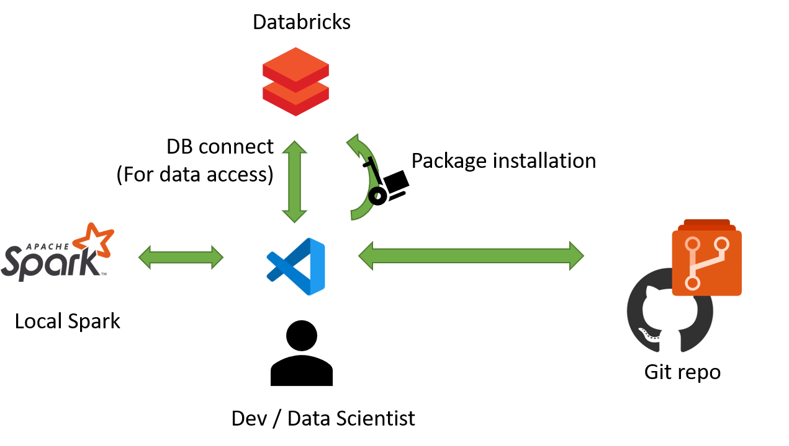
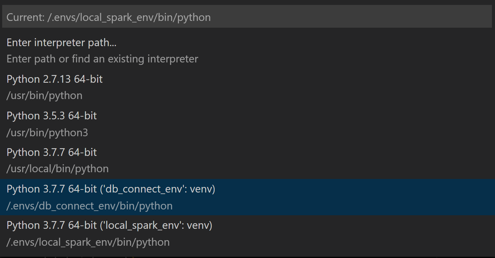

# Inner loop dev environment for Databricks

## Overview

This repository provides container-based inner loop development environment for [Databricks](https://docs.databricks.com/getting-started/index.html). The container includes the following Python environments.

- local pyspark
- pyspark running on remote cluster through [Databricks Connect](https://docs.databricks.com/dev-tools/databricks-connect.html)
  - Databricks Connect allows you to execute your local spark code remotely on a Databricks cluster instead of in the local Spark session.
  - Databricks enables you to interact with the data sitting in the Cloud while staying and coding on local VSCode.

### Why not Databricks Notebooks?

Databricks offers [Databricks Notebooks](https://docs.databricks.com/notebooks/index.html) to implement features but you can't leverage python tooling such as:

- python related auto-completion
- sophisticated debugger
- python definition peeking
- auto-formatter
- auto-linter
- auto static analyzer
- unit tests

To accelerate your inner loop dev cycle, this repo fully leverages python tooling and VSCode extensions in contrast. This repo centers VSCode as a place to do most of implementations. You can switch python env with one click on VSCode.

### Suggested workflow

Suggested workflow with this repo is the following:

1. Implement features with local pyspark
1. Put unit tests with sample data locally
1. (Optional) When you want to interact with data sitting in the Cloud, you can switch to databricks connect env
1. Package all the code into library
1. Upload that library to a Databricks cluster
1. Install that library into the cluster and test it with the real data
1. (After multiple iterations of 1-6) Create Pull Request

## Pre-requisites

This repo uses VSCode as a development tool and The Remote - Containers extension that lets you use a Docker container as a full-featured development environment.

Install the following tools:

- [VSCode](https://code.visualstudio.com/)
- [Docker Desktop for Windows or Mac](https://www.docker.com/products/docker-desktop)
- [VSCode Remote - Containers extension](https://marketplace.visualstudio.com/items?itemName=ms-vscode-remote.remote-containers)
  - Check [System Requirements and Installation](https://marketplace.visualstudio.com/items?itemName=ms-vscode-remote.remote-containers) carefully. For example, if you are on Windows and not using WSL2 backend engine for Docker, you need to enable File Sharing.

## Getting started

Take the following steps to get started.

1. Open this repository with VSCode.
1. Copy `.env.example` and rename it to `.env`.
1. Edit `.env` file. The dev container loads the defined variables into environment variables and uses them for Databricks Connect.
    - *`DATABRICKS_ADDRESS`*: Databricks workspace URL
    - *`DATABRICKS_API_TOKEN`*: personal access token (PAT) token to Databricks workspace
    - *`DATABRICKS_CLUSTER_ID`*: Cluster ID of Databricks cluster
    - *`DATABRICKS_ORG_ID`*: Org ID. See ?o=orgId in URL
    - *`DATABRICKS_PORT`*. Use 15001
    - For more information about how to set up variables for Databricks Connect, see [Step 2: Configure connection properties](https://docs.databricks.com/dev-tools/databricks-connect.html#step-2-configure-connection-properties)
1. Edit `requirements_db_connect.txt` and match `databricks-connect` version with your cluster version. See [Step 1: Install the client](https://docs.databricks.com/dev-tools/databricks-connect.html#step-1-install-the-client) for the details.
1. Edit `requirements_local.txt` and match `pyspark` version with your cluster's pyspark version.
1. Open VSCode command palette (`ctrl+shift+p`) and select `Remote-Containers: Reopen in Container`. It may take a while for the first time as it builds a devcontainer.
1. Activate `db_connect_env` python environment with `source /.envs/db_connect_env/bin/activate`.
1. Run `databricks-connect test` and see if your setting for Databricks Connect with environment variables works.

## How to switch python environment on VSCode

Default python environment is `local_spark_env`. If you want to switch it to Databricks Connect env, open VSCode command palette (`ctrl+shift+p`), select `Python: Select Interpreter` and select `db_connect_env`.

## How to run pyspark code

1. Open your python file
1. Open VSCode command palette (`ctrl+shift+p`) and select `Python: Run Python File in Terminal`

To test this functionality, you can open `src/main.py`. When you run it, be aware which python env you selected on VSCode.

## Enabled python tooling and VSCode extensions

If you want to change the tool setting, see `requirements_dev.txt` and `.devcontainer/devcontainer.json`. `requirements_dev.txt` states what python libraries are installed to both `local_spark_env` and `db_connect_env`. `.devcontainer/devcontainer.json` states what VSCode extensions are installed and what python tooling are enabled on VSCode.

The following libraries are enabled as default:

- yapf
- bandit
- mypy
- flake8
- pytest

## Limitations

Databricks's [display function](https://docs.databricks.com/notebooks/visualizations/index.html#display-function-1) doesn't work on local spark or on databricks connect. When you want to visualize data, use normal python visualization libraries or use [Databricks Notebooks](https://docs.databricks.com/notebooks/index.html).
